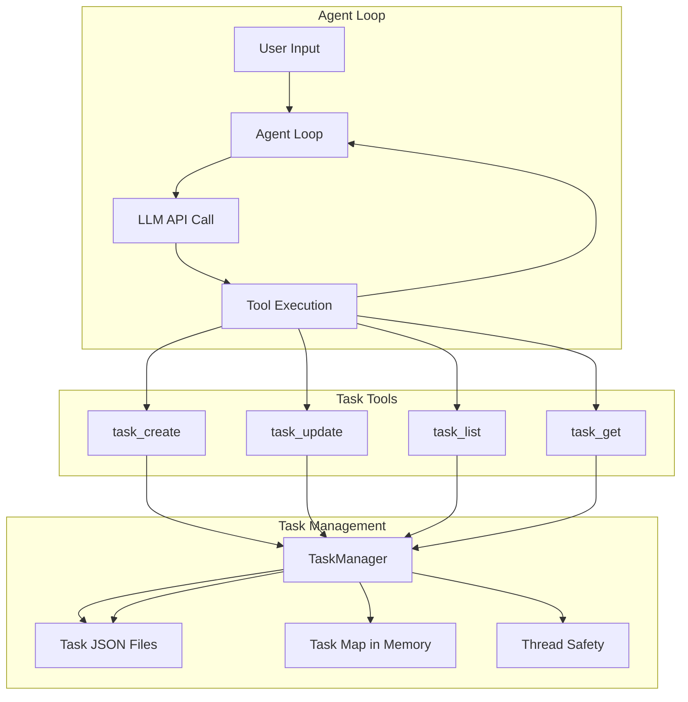
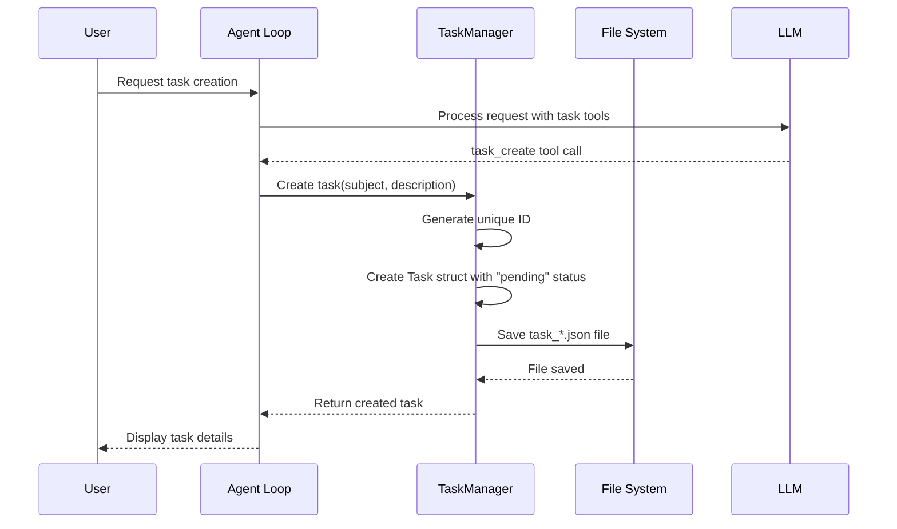
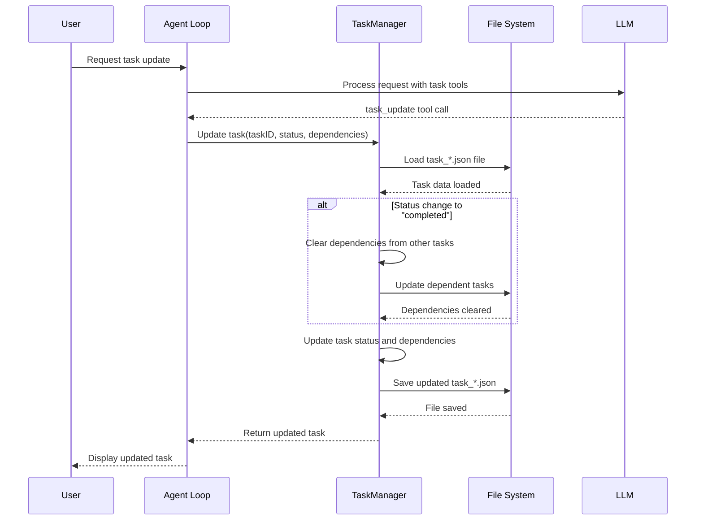
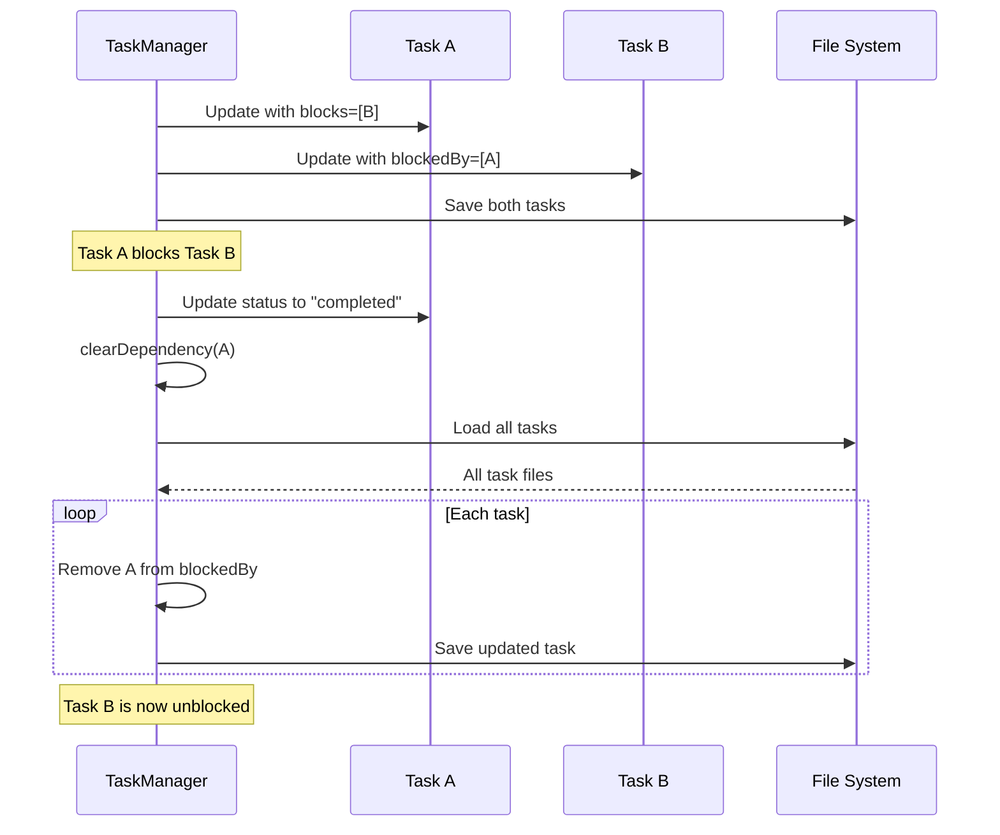
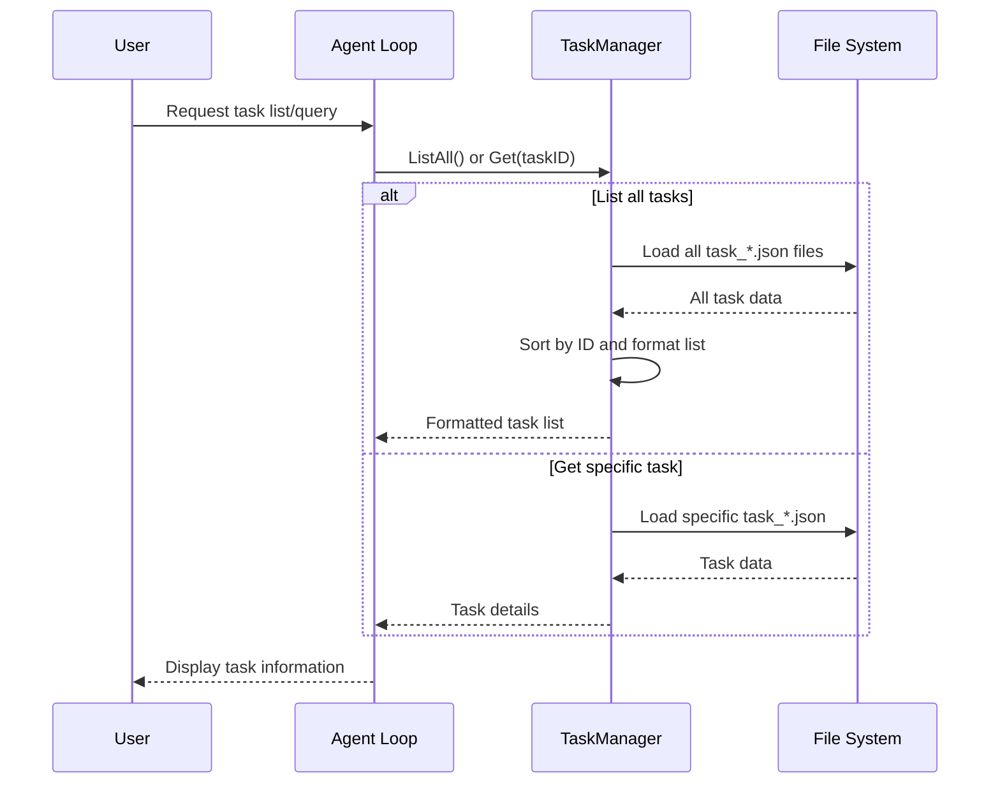
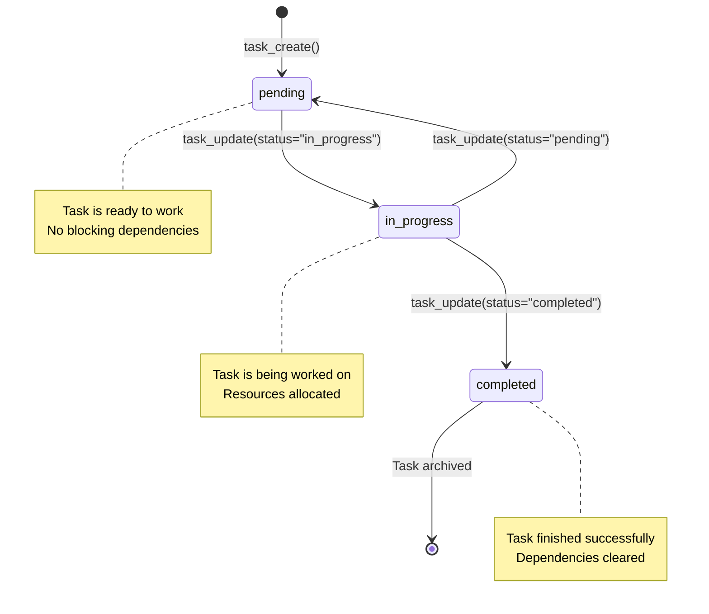
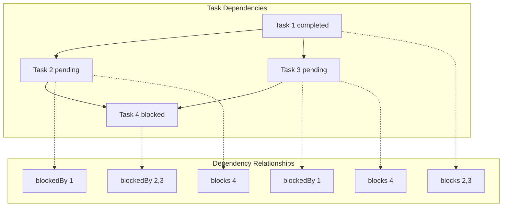
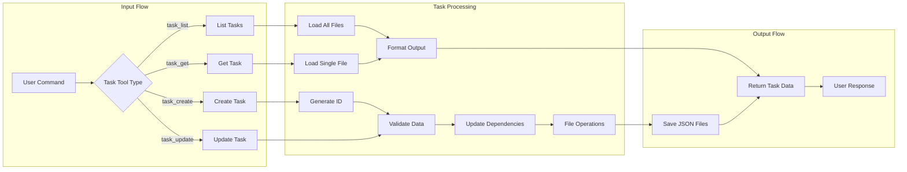
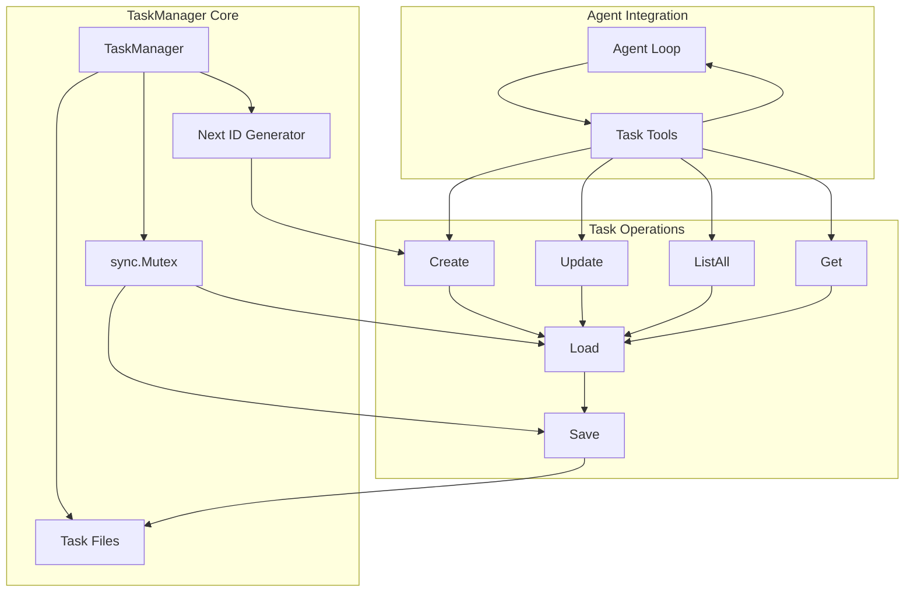

# s07: Task System (任务系统)

`s01 > s02 > s03 > s04 > s05 > s06 | [ s07 ] s08 > s09 > s10 > s11 > s12`

> _"大目标要拆成小任务, 排好序, 记在磁盘上"_ -- 文件持久化的任务图, 为多 agent 协作打基础。
>
> **Harness 层**: 持久化任务 -- 比任何一次对话都长命的目标。

## 问题

s03 的 TodoManager 只是内存中的扁平清单: 没有顺序、没有依赖、状态只有做完没做完。真实目标是有结构的 -- 任务 B 依赖任务 A, 任务 C 和 D 可以并行, 任务 E 要等 C 和 D 都完成。

没有显式的关系, 智能体分不清什么能做、什么被卡住、什么能同时跑。而且清单只活在内存里, 上下文压缩 (s06) 一跑就没了。

## 解决方案

把扁平清单升级为持久化到磁盘的**任务图**。每个任务是一个 JSON 文件, 有状态、前置依赖 (`blockedBy`) 和后置依赖 (`blocks`)。任务图随时回答三个问题:

- **什么可以做?** -- 状态为 `pending` 且 `blockedBy` 为空的任务。
- **什么被卡住?** -- 等待前置任务完成的任务。
- **什么做完了?** -- 状态为 `completed` 的任务, 完成时自动解锁后续任务。

```
.tasks/
  task_1.json  {"id":1, "status":"completed"}
  task_2.json  {"id":2, "blockedBy":[1], "status":"pending"}
  task_3.json  {"id":3, "blockedBy":[1], "status":"pending"}
  task_4.json  {"id":4, "blockedBy":[2,3], "status":"pending"}

任务图 (DAG):
                 +----------+
            +--> | task 2   | --+
            |    | pending  |   |
+----------+     +----------+    +--> +----------+
| task 1   |                          | task 4   |
| completed| --> +----------+    +--> | blocked  |
+----------+     | task 3   | --+     +----------+
                 | pending  |
                 +----------+

顺序:   task 1 必须先完成, 才能开始 2 和 3
并行:   task 2 和 3 可以同时执行
依赖:   task 4 要等 2 和 3 都完成
状态:   pending -> in_progress -> completed
```

这个任务图是 s07 之后所有机制的协调骨架: 后台执行 (s08)、多 agent 团队 (s09+)、worktree 隔离 (s12) 都读写这同一个结构。

## 工作原理

#### System Prompt

```
You are a coding agent at %s. Use task tools to plan and track work.
```

1. **TaskManager**: 每个任务一个 JSON 文件, CRUD + 依赖图。

```go
// TaskManager manages tasks persisted as JSON files.
type TaskManager struct {
	dir    string
	mu     sync.Mutex
	nextID int
}

// NewTaskManager creates a new TaskManager
func NewTaskManager(tasksDir string) *TaskManager {
	_ = os.MkdirAll(tasksDir, 0755)
	tm := &TaskManager{dir: tasksDir}
	tm.nextID = tm.maxID() + 1
	return tm
}

func (tm *TaskManager) Create(subject, description string) (string, error) {
	tm.mu.Lock()
	defer tm.mu.Unlock()

	task := &Task{
		ID:          tm.nextID,
		Subject:     subject,
		Description: description,
		Status:      "pending",
		BlockedBy:   []int{},
		Blocks:      []int{},
	}
	if err := tm.save(task); err != nil {
		return "", err
	}
	tm.nextID++
	result, _ := json.MarshalIndent(task, "", "  ")
	return string(result), nil
}
```

2. **依赖解除**: 完成任务时, 自动将其 ID 从其他任务的 `blockedBy` 中移除, 解锁后续任务。

```go
func (tm *TaskManager) clearDependency(completedID int) {
	files, _ := filepath.Glob(filepath.Join(tm.dir, "task_*.json"))
	for _, file := range files {
		if task, err := tm.load(tm.extractID(file)); err == nil {
			var newBlockedBy []int
			for _, id := range task.BlockedBy {
				if id != completedID {
					newBlockedBy = append(newBlockedBy, id)
				}
			}
			task.BlockedBy = newBlockedBy
			tm.save(task)
		}
	}
}
```

3. **状态变更 + 依赖关联**: `update` 处理状态转换和依赖边。

```go
func (tm *TaskManager) Update(taskID int, status *string, addBlockedBy, addBlocks []int) (string, error) {
	tm.mu.Lock()
	defer tm.mu.Unlock()

	task, err := tm.load(taskID)
	if err != nil {
		return "", err
	}

	if status != nil {
		if *status != "pending" && *status != "in_progress" && *status != "completed" {
			return "", fmt.Errorf("invalid status: %s", *status)
		}
		task.Status = *status
		if *status == "completed" {
			tm.clearDependency(taskID)
		}
	}

	if addBlockedBy != nil {
		task.BlockedBy = append(task.BlockedBy, addBlockedBy...)
	}
	if addBlocks != nil {
		task.Blocks = append(task.Blocks, addBlocks...)
		for _, blockedID := range addBlocks {
			if blockedTask, err := tm.load(blockedID); err == nil {
				blockedTask.BlockedBy = append(blockedTask.BlockedBy, taskID)
				tm.save(blockedTask)
			}
		}
	}

	if err := tm.save(task); err != nil {
		return "", err
	}
	result, _ := json.MarshalIndent(task, "", "  ")
	return string(result), nil
}
```

4. 四个任务工具加入 dispatch map。

```go
// Tool Handlers Map
var toolHandlers = map[string]interface{}{
	// ...base tools...
	"task_create": func(args map[string]interface{}) string {
		subject, _ := args["subject"].(string)
		description, _ := args["description"].(string)
		result, err := tasks.Create(subject, description)
		if err != nil {
			return fmt.Sprintf("Error: %v", err)
		}
		return result
	},
	"task_update": func(args map[string]interface{}) string {
		taskID := int(args["task_id"].(float64))
		var status *string
		if s, ok := args["status"].(string); ok {
			status = &s
		}
		var addBlockedBy, addBlocks []int
		if b, ok := args["addBlockedBy"].([]interface{}); ok {
			for _, v := range b {
				addBlockedBy = append(addBlockedBy, int(v.(float64)))
			}
		}
		if b, ok := args["addBlocks"].([]interface{}); ok {
			for _, v := range b {
				addBlocks = append(addBlocks, int(v.(float64)))
			}
		}
		result, err := tasks.Update(taskID, status, addBlockedBy, addBlocks)
		if err != nil {
			return fmt.Sprintf("Error: %v", err)
		}
		return result
	},
	"task_list": func(args map[string]interface{}) string {
		result, err := tasks.ListAll()
		if err != nil {
			return fmt.Sprintf("Error: %v", err)
		}
		return result
	},
	"task_get": func(args map[string]interface{}) string {
		taskID := int(args["task_id"].(float64))
		result, err := tasks.Get(taskID)
		if err != nil {
			return fmt.Sprintf("Error: %v", err)
		}
		return result
	},
}
```

从 s07 起, 任务图是多步工作的默认选择。s03 的 Todo 仍可用于单次会话内的快速清单。

## 相对 s06 的变更

| 组件     | 之前 (s06)        | 之后 (s07)                                |
| -------- | ----------------- | ----------------------------------------- |
| Tools    | 5                 | 8 (`task_create/update/list/get`)         |
| 规划模型 | 扁平清单 (仅内存) | 带依赖关系的任务图 (磁盘)                 |
| 关系     | 无                | `blockedBy` + `blocks` 边                 |
| 状态追踪 | 做完没做完        | `pending` -> `in_progress` -> `completed` |
| 持久化   | 压缩后丢失        | 压缩和重启后存活                          |

## 试一试

```sh
cd ai-agent-study/s07
go run main.go
```

试试这些 prompt (英文 prompt 对 LLM 效果更好, 也可以用中文):

1. `Create 3 tasks: "Setup project", "Write code", "Write tests". Make them depend on each other in order.`
2. `List all tasks and show the dependency graph`
3. `Complete task 1 and then list tasks to see task 2 unblocked`
4. `Create a task board for refactoring: parse -> transform -> emit -> test, where transform and emit can run in parallel after parse`

## 业务流程图

### 系统架构总览



### 详细流程序列

#### 1. 任务创建流程



#### 2. 任务更新流程



#### 3. 任务依赖管理流程



#### 4. 任务列表和查询流程



### 关键状态转换



### 依赖图架构



### 数据流架构



### 核心组件交互


