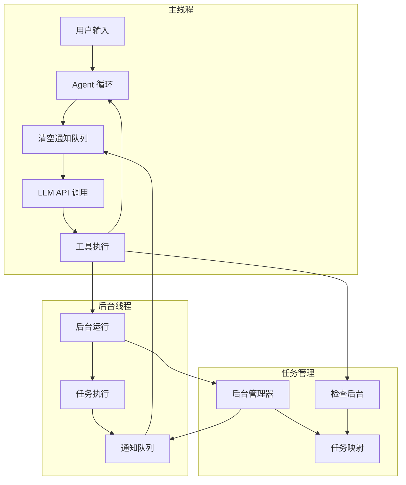
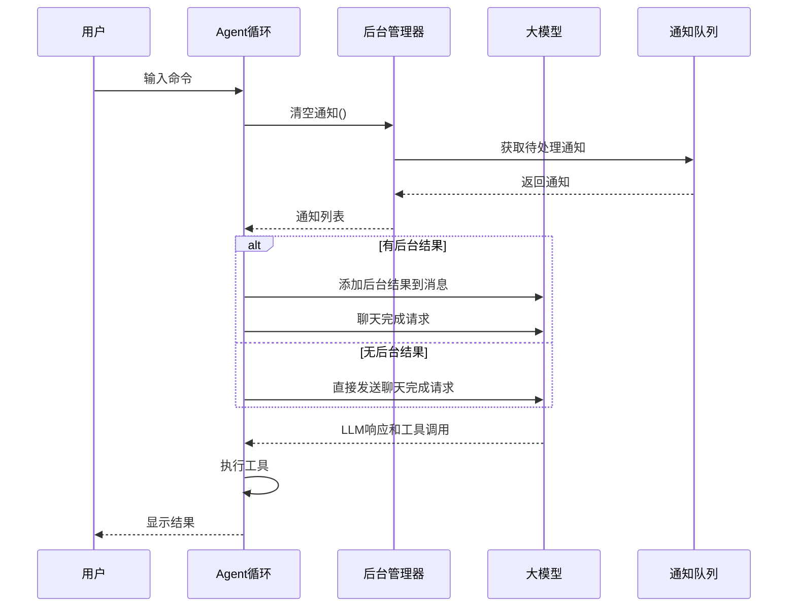
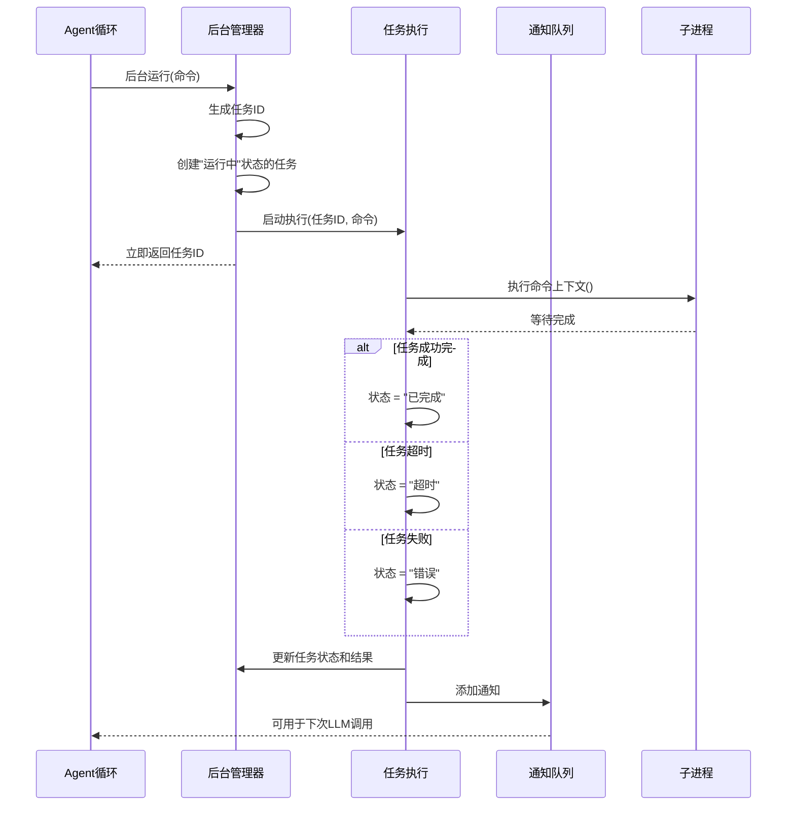
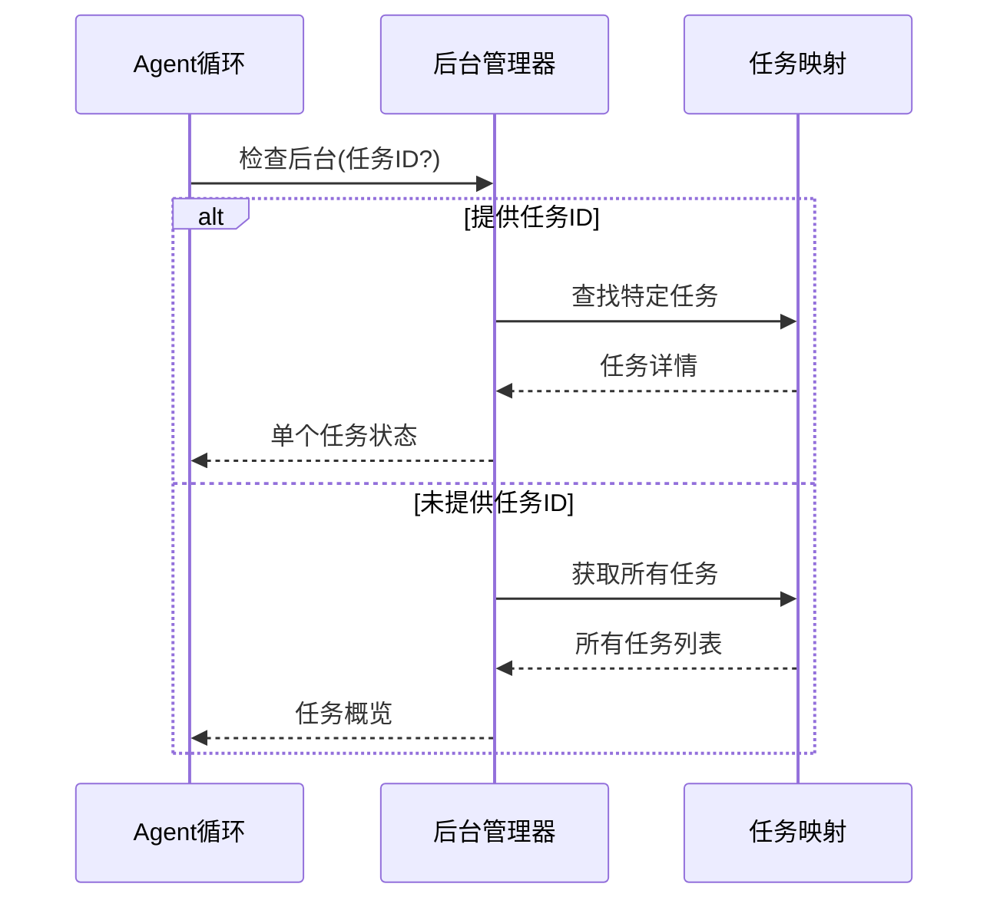
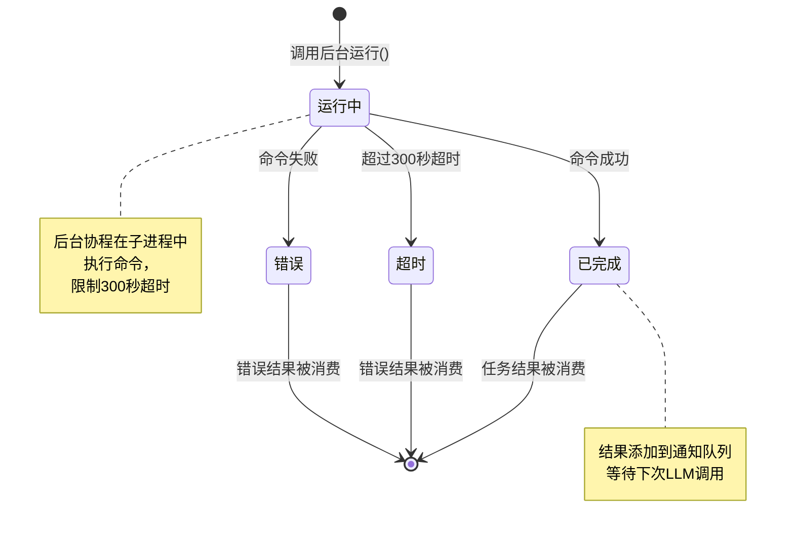
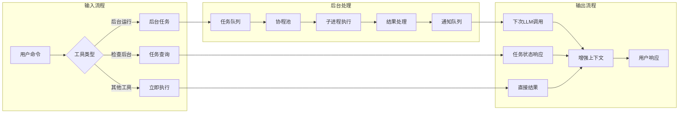
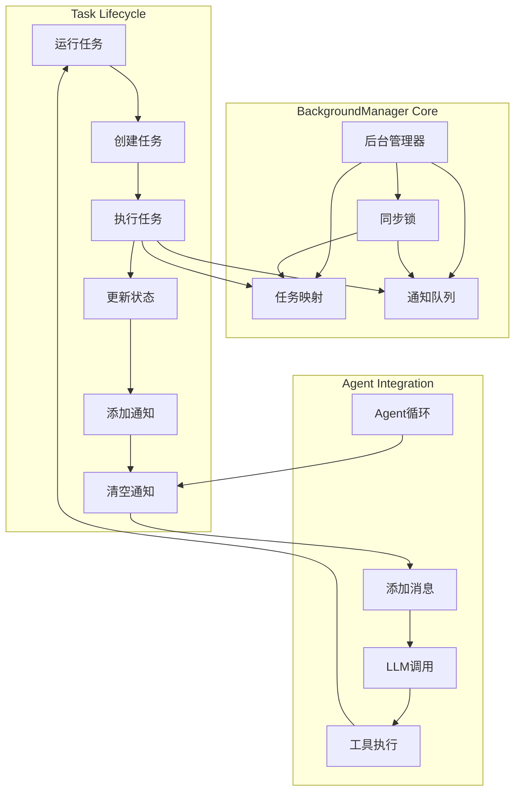

# s08: Background Tasks (后台任务)

`s01 > s02 > s03 > s04 > s05 > s06 | s07 > [ s08 ] s09 > s10 > s11 > s12`

> _"慢操作丢后台, agent 继续想下一步"_ -- 后台线程跑命令, 完成后注入通知。
>
> **Harness 层**: 后台执行 -- 模型继续思考, harness 负责等待。

## 问题

有些命令要跑好几分钟: `npm install`、`pytest`、`docker build`。阻塞式循环下模型只能干等。用户说 "装依赖, 顺便建个配置文件", 智能体却只能一个一个来。

## 解决方案

```
Main thread                Background thread
+-----------------+        +-----------------+
| agent loop      |        | subprocess runs |
| ...             |        | ...             |
| [LLM call] <---+------- | enqueue(result) |
|  ^drain queue   |        +-----------------+
+-----------------+

Timeline:
Agent --[spawn A]--[spawn B]--[other work]----
             |          |
             v          v
          [A runs]   [B runs]      (parallel)
             |          |
             +-- results injected before next LLM call --+
```

## 工作原理

#### System Prompt

```
You are a coding agent at %s. Use background_run for long-running commands.
```

1. BackgroundManager 用线程安全的通知队列追踪任务。

```go
// BackgroundManager 管理后台异步任务。
type BackgroundManager struct {
	tasks             map[string]*Task // 存储所有任务的映射表
	notificationQueue []Notification   // 待通知给大模型的消息队列
	mu                sync.Mutex       // 保证并发安全的互斥锁
}

// NewBackgroundManager 创建一个新的后台任务管理器。
func NewBackgroundManager() *BackgroundManager {
	return &BackgroundManager{
		tasks: make(map[string]*Task),
	}
}
```

2. `run()` 启动守护线程, 立即返回。

```go
// Run 启动一个异步后台任务。
// 它会立即返回任务 ID，并在后台协程中执行命令。
func (bm *BackgroundManager) Run(command string) string {
	// 生成一个基于当前纳秒时间戳的简单 8 位任务 ID
	taskID := strconv.FormatInt(time.Now().UnixNano(), 10)[:8]

	bm.mu.Lock()
	bm.tasks[taskID] = &Task{Status: "running", Command: command}
	bm.mu.Unlock()

	// 启动协程异步执行任务
	go bm.execute(taskID, command)

	return fmt.Sprintf("Background task %s started: %s", taskID, command)
}
```

3. 子进程完成后, 结果进入通知队列。

```go
// execute 是内部执行函数，负责实际运行命令并更新任务状态。
func (bm *BackgroundManager) execute(taskID, command string) {
	// 为后台任务设置 300 秒超时限制
	ctx, cancel := context.WithTimeout(context.Background(), 300*time.Second)
	defer cancel()

	cmd := exec.CommandContext(ctx, "sh", "-c", command)
	cmd.Dir = workdir
	var out bytes.Buffer
	cmd.Stdout = &out
	cmd.Stderr = &out

	err := cmd.Run()
	output := out.String()
	status := "completed"

	// 处理超时和执行错误
	if ctx.Err() == context.DeadlineExceeded {
		output = "Error: Timeout (300s)"
		status = "timeout"
	} else if err != nil {
		output = fmt.Sprintf("Error: %v\nOutput:\n%s", err, output)
		status = "error"
	}

	bm.mu.Lock()
	defer bm.mu.Unlock()

	// 更新任务状态和结果
	task := bm.tasks[taskID]
	task.Status = status
	task.Result = output

	// 将完成的消息加入通知队列
	bm.notificationQueue = append(bm.notificationQueue, Notification{
		TaskID:  taskID,
		Status:  status,
		Command: command,
		Result:  output,
	})
}
```

4. 每次 LLM 调用前排空通知队列。

```go
func agentLoop(messages *[]Message) {
	*messages = append([]Message{{Role: "system", Content: system}}, *messages...)
	for {
		notifs := bg.DrainNotifications()
		if len(notifs) > 0 {
			fmt.Println(">>>Background notifications:", notifs)
			var notifTexts []string
			for _, n := range notifs {
				notifTexts = append(notifTexts, fmt.Sprintf("[bg:%s] %s: %s", n.TaskID, n.Status, n.Result))
			}
			*messages = append(*messages, Message{Role: "user", Content: fmt.Sprintf("<background-results>\n%s\n</background-results>", strings.Join(notifTexts, "\n"))})
			*messages = append(*messages, Message{Role: "assistant", Content: "Noted background results."})
		}

		msg, err := chatCompletionsCreate(*messages, openAITools())

		if err != nil {
			log.Printf("Error calling API: %v", err)
			return
		}

		*messages = append(*messages, msg)

		if len(msg.ToolCalls) == 0 {
			if msg.Content != "" {
				fmt.Println(msg.Content)
			}
			return
		}

		for _, tc := range msg.ToolCalls {
			name := tc.Function.Name
			var args map[string]interface{}
			json.Unmarshal([]byte(tc.Function.Arguments), &args)

			handler, ok := toolHandlers[name]
			var output string
			if ok {
				output = handler.(func(map[string]interface{}) string)(args)
			} else {
				output = fmt.Sprintf("Unknown tool: %s", name)
			}

			if len(output) > 200 {
				fmt.Printf(">✌️ 执行命令:%s \n ✌️ 参数:%+v \n ✌️ 结果:%s...✌️\n\n\n", name, args, output[:200])
			} else {
				fmt.Printf(">✌️ 执行命令:%s \n ✌️ 参数:%+v \n ✌️ 结果:%s ✌️\n\n\n", name, args, output)
			}

			*messages = append(*messages, Message{
				Role:       "tool",
				ToolCallID: tc.ID,
				Content:    output,
			})
		}
	}
}
```

循环保持单线程。只有子进程 I/O 被并行化。

## 相对 s07 的变更

| 组件     | 之前 (s07) | 之后 (s08)                        |
| -------- | ---------- | --------------------------------- |
| Tools    | 8          | 6 (基础 + background_run + check) |
| 执行方式 | 仅阻塞     | 阻塞 + 后台线程                   |
| 通知机制 | 无         | 每轮排空的队列                    |
| 并发     | 无         | 守护线程                          |

## 试一试

```sh
cd ai-agent-study/s08
go run main.go
```

试试这些 prompt (英文 prompt 对 LLM 效果更好, 也可以用中文):

1. `Run "sleep 5 && echo done" in the background, then create a file while it runs`
2. `Start 3 background tasks: "sleep 2", "sleep 4", "sleep 6". Check their status.`
3. `Run pytest in the background and keep working on other things`

## 业务流程图

### 系统架构总览



### 详细流程序列

#### 1. 用户交互与 Agent 主循环流程



#### 2. 后台任务执行流程



#### 3. 任务状态检查流程



### 关键状态转换



### 数据流架构



### 核心组件交互


