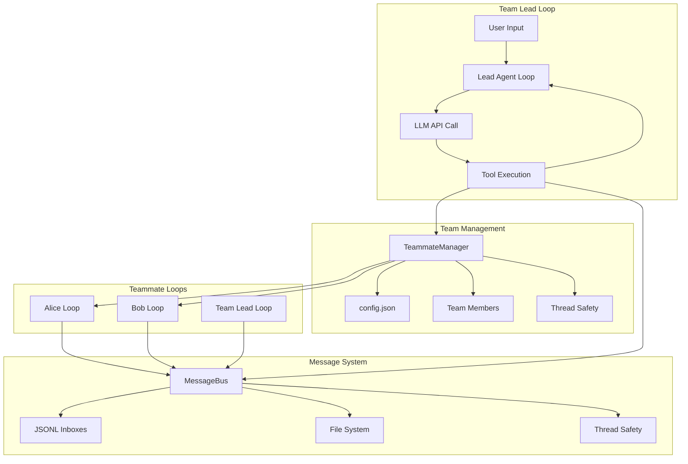
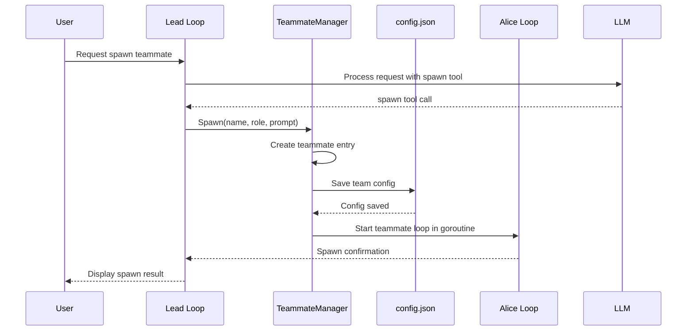
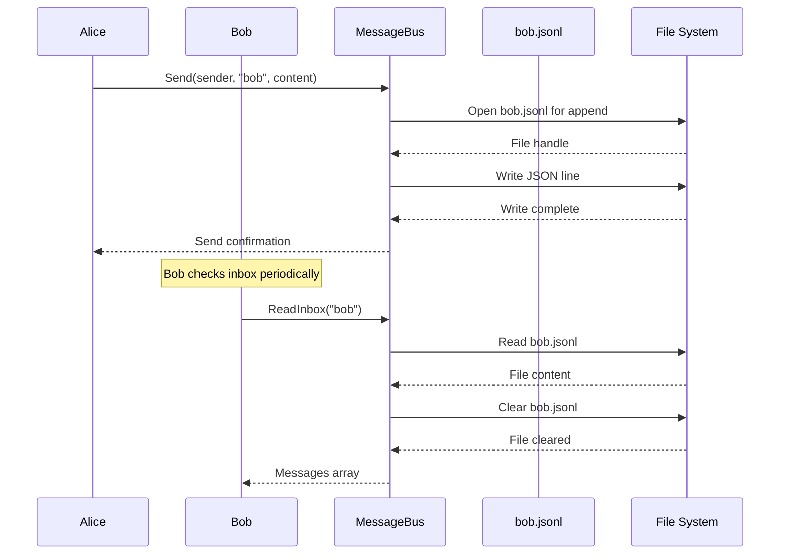
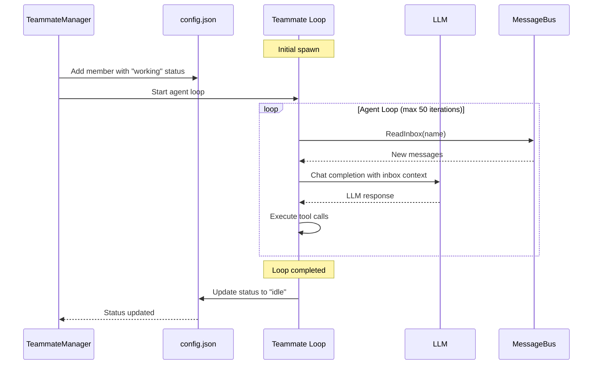
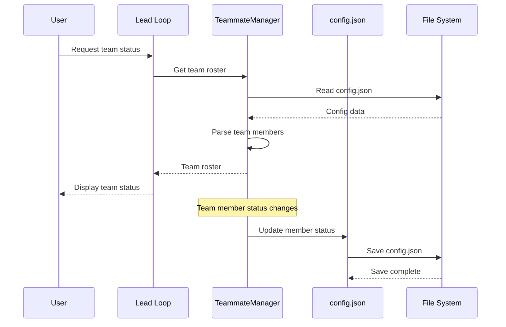
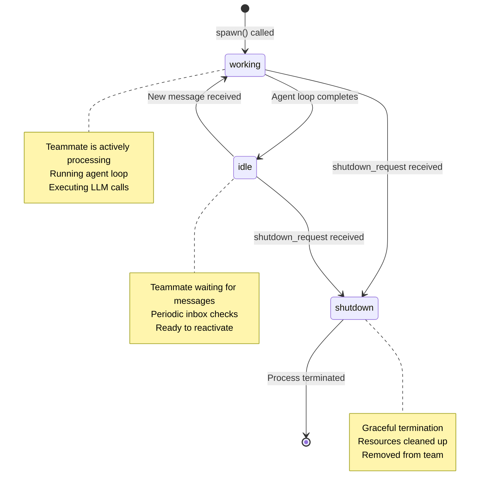
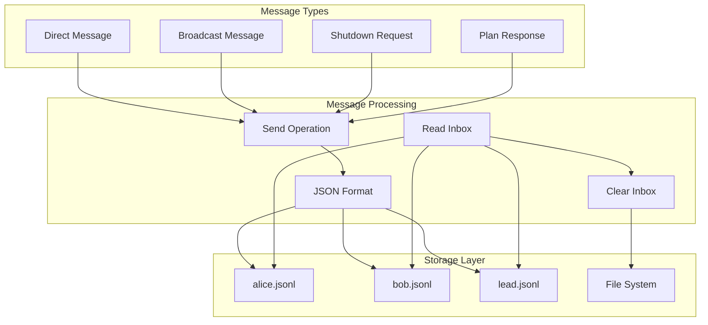
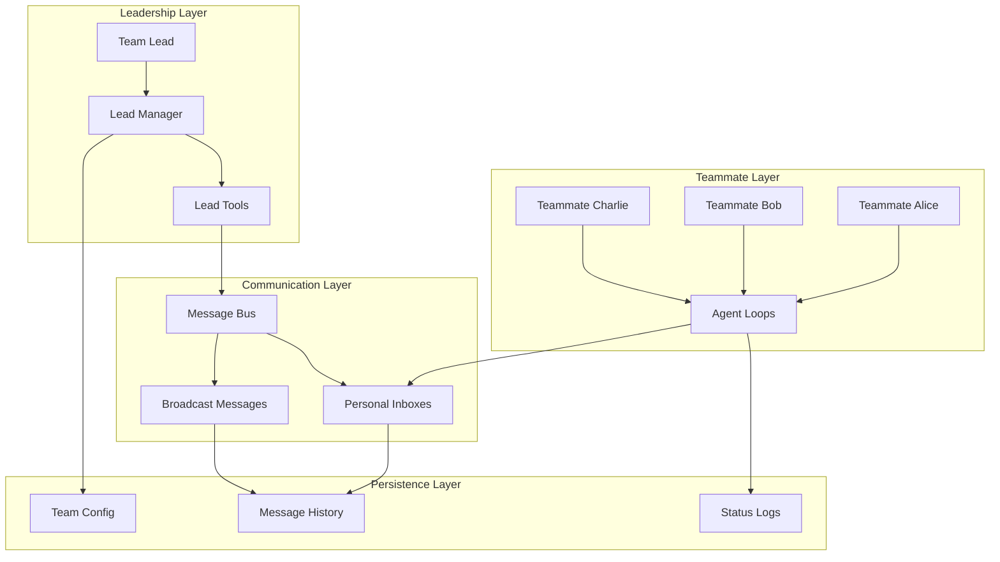
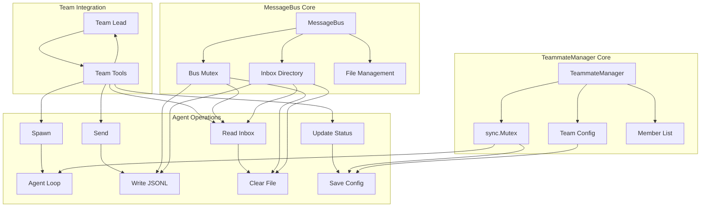

# s09: Agent Teams (智能体团队)

`s01 > s02 > s03 > s04 > s05 > s06 | s07 > s08 > [ s09 ] s10 > s11 > s12`

> _"任务太大一个人干不完, 要能分给队友"_ -- 持久化队友 + JSONL 邮箱。
>
> **Harness 层**: 团队邮箱 -- 多个模型, 通过文件协调。

## 问题

子智能体 (s04) 是一次性的: 生成、干活、返回摘要、消亡。没有身份, 没有跨调用的记忆。后台任务 (s08) 能跑 shell 命令, 但做不了 LLM 引导的决策。

真正的团队协作需要三样东西: (1) 能跨多轮对话存活的持久智能体, (2) 身份和生命周期管理, (3) 智能体之间的通信通道。

## 解决方案

```
Teammate lifecycle:
  spawn -> WORKING -> IDLE -> WORKING -> ... -> SHUTDOWN

Communication:
  .team/
    config.json           <- team roster + statuses
    inbox/
      alice.jsonl         <- append-only, drain-on-read
      bob.jsonl
      lead.jsonl

              +--------+    send("alice","bob","...")    +--------+
              | alice  | -----------------------------> |  bob   |
              | loop   |    bob.jsonl << {json_line}    |  loop  |
              +--------+                                +--------+
                   ^                                         |
                   |        BUS.read_inbox("alice")          |
                   +---- alice.jsonl -> read + drain ---------+
```

## 工作原理

#### System Prompt

```
You are a team lead at %s. Spawn teammates and communicate via inboxes.
```

1. TeammateManager 通过 config.json 维护团队名册。

```go
// TeammateManager 管理团队成员和他们的状态
type TeammateManager struct {
	dir    string
	config TeamConfig
	mu     sync.Mutex
}

// NewTeammateManager 创建新的团队管理器
func NewTeammateManager(teamDir string) *TeammateManager {
	os.MkdirAll(teamDir, 0755)
	tm := &TeammateManager{dir: teamDir}
	tm.config = tm.loadConfig()
	return tm
}
```

2. `spawn()` 创建队友并在线程中启动 agent loop。

```go
func (tm *TeammateManager) Spawn(name, role, prompt string) string {
	tm.mu.Lock()
	defer tm.mu.Unlock()

	member := Teammate{
		Name:   name,
		Role:   role,
		Status: "working",
	}
	tm.config.Members = append(tm.config.Members, member)
	tm.saveConfig()

	// 启动队友的 agent loop
	go tm.teammateLoop(name, role, prompt)

	return fmt.Sprintf("Spawned teammate '%s' (role: %s)", name, role)
}
```

3. MessageBus: append-only 的 JSONL 收件箱。`send()` 追加一行; `read_inbox()` 读取全部并清空。

```go
// MessageBus 管理智能体之间的消息传递
type MessageBus struct {
	dir string
	mu  sync.Mutex
}

// NewMessageBus 创建新的消息总线
func NewMessageBus(dir string) *MessageBus {
	os.MkdirAll(dir, 0755)
	return &MessageBus{dir: dir}
}

// Send 发送消息到指定收件人
func (bus *MessageBus) Send(sender, to, content, msgType string, extra interface{}) error {
	msg := InboxMessage{
		Type:      msgType,
		From:      sender,
		Content:   content,
		Timestamp: float64(time.Now().UnixNano()) / 1e9,
		Extra:     extra,
	}

	bus.mu.Lock()
	defer bus.mu.Unlock()

	inboxPath := filepath.Join(bus.dir, fmt.Sprintf("%s.jsonl", to))
	file, err := os.OpenFile(inboxPath, os.O_CREATE|os.O_WRONLY|os.O_APPEND, 0644)
	if err != nil {
		return err
	}
	defer file.Close()

	data, _ := json.Marshal(msg)
	file.Write(append(data, '\n'))
	return nil
}

// ReadInbox 读取指定用户的收件箱
func (bus *MessageBus) ReadInbox(name string) ([]InboxMessage, error) {
	bus.mu.Lock()
	defer bus.mu.Unlock()

	inboxPath := filepath.Join(bus.dir, fmt.Sprintf("%s.jsonl", name))
	if _, err := os.Stat(inboxPath); os.IsNotExist(err) {
		return nil, nil
	}

	content, err := os.ReadFile(inboxPath)
	if err != nil {
		return nil, err
	}

	var messages []InboxMessage
	for _, line := range strings.Split(string(content), "\n") {
		if line != "" {
			var msg InboxMessage
			if err := json.Unmarshal([]byte(line), &msg); err == nil {
				messages = append(messages, msg)
			}
		}
	}

	// 清空收件箱
	os.WriteFile(inboxPath, []byte(""), 0644)
	return messages, nil
}
```

4. 每个队友在每次 LLM 调用前检查收件箱, 将消息注入上下文。

```go
func (tm *TeammateManager) teammateLoop(name, role, prompt string) {
	messages := []Message{{Role: "user", Content: prompt}}
	for i := 0; i < 50; i++ {
		// 检查收件箱
		inboxMsgs, err := bus.ReadInbox(name)
		if err == nil && len(inboxMsgs) > 0 {
			var inboxTexts []string
			for _, msg := range inboxMsgs {
				inboxTexts = append(inboxTexts, fmt.Sprintf("[%s] %s: %s", msg.Type, msg.From, msg.Content))
			}
			messages = append(messages, Message{Role: "user", Content: fmt.Sprintf("<inbox>\n%s\n</inbox>", strings.Join(inboxTexts, "\n"))})
			messages = append(messages, Message{Role: "assistant", Content: "Noted inbox messages."})
		}

		// 调用 LLM
		msg, err := chatCompletionsCreate(messages, openAITools())
		if err != nil {
			log.Printf("Error in teammate loop: %v", err)
			break
		}

		messages = append(messages, msg)

		if len(msg.ToolCalls) == 0 {
			break
		}

		// 执行工具调用
		for _, tc := range msg.ToolCalls {
			// ... 工具执行逻辑 ...
		}
	}

	// 更新状态为 idle
	tm.mu.Lock()
	for i, member := range tm.config.Members {
		if member.Name == name {
			tm.config.Members[i].Status = "idle"
			break
		}
	}
	tm.mu.Unlock()
}
```

## 相对 s08 的变更

| 组件       | 之前 (s08) | 之后 (s09)                 |
| ---------- | ---------- | -------------------------- |
| Tools      | 6          | 9 (+spawn/send/read_inbox) |
| 智能体数量 | 单一       | 领导 + N 个队友            |
| 持久化     | 无         | config.json + JSONL 收件箱 |
| 线程       | 后台命令   | 每线程完整 agent loop      |
| 生命周期   | 一次性     | idle -> working -> idle    |
| 通信       | 无         | message + broadcast        |

## 试一试

```sh
cd ai-agent-study/s09
go run main.go
```

试试这些 prompt (英文 prompt 对 LLM 效果更好, 也可以用中文):

1. `Spawn alice (coder) and bob (tester). Have alice send bob a message.`
2. `Broadcast "status update: phase 1 complete" to all teammates`
3. `Check the lead inbox for any messages`
4. 输入 `/team` 查看团队名册和状态
5. 输入 `/inbox` 手动检查领导的收件箱

## 业务流程图

### 系统架构总览



### 详细流程序列

#### 1. 队友创建流程



#### 2. 消息通信流程



#### 3. 队友生命周期流程



#### 4. 团队配置管理流程



### 关键状态转换



### 消息流架构



### 团队协调架构



### 核心组件交互


