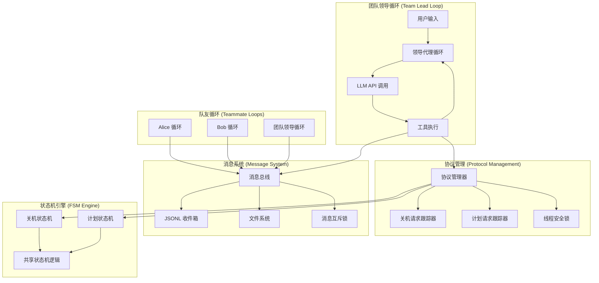
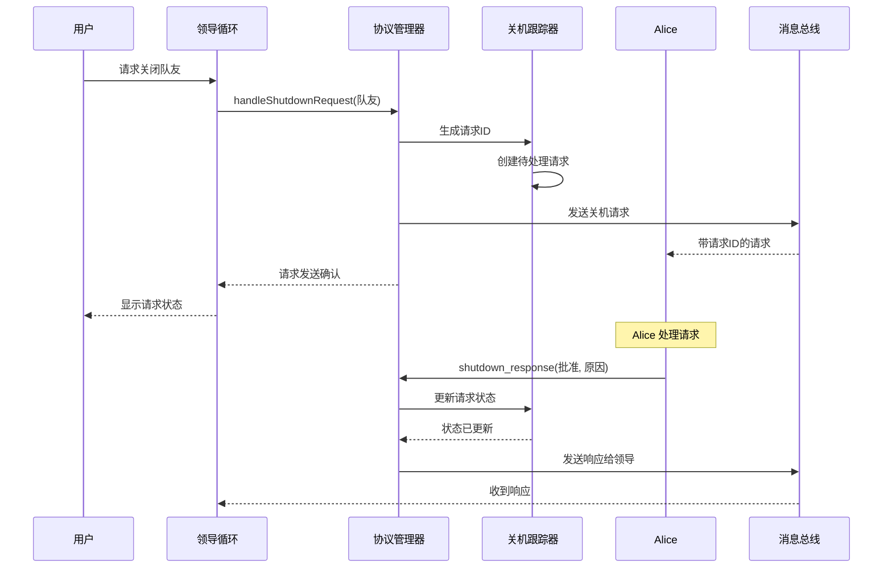
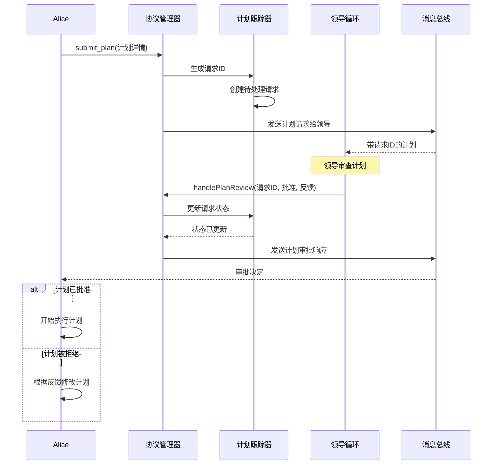
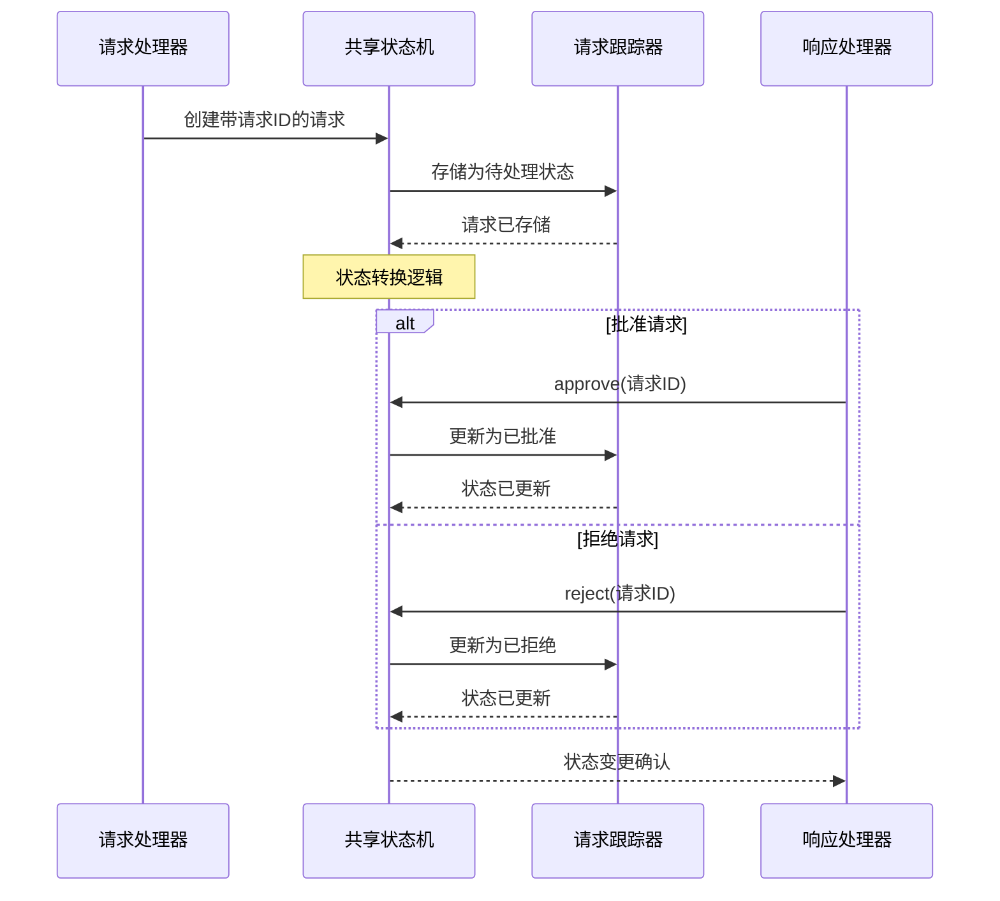
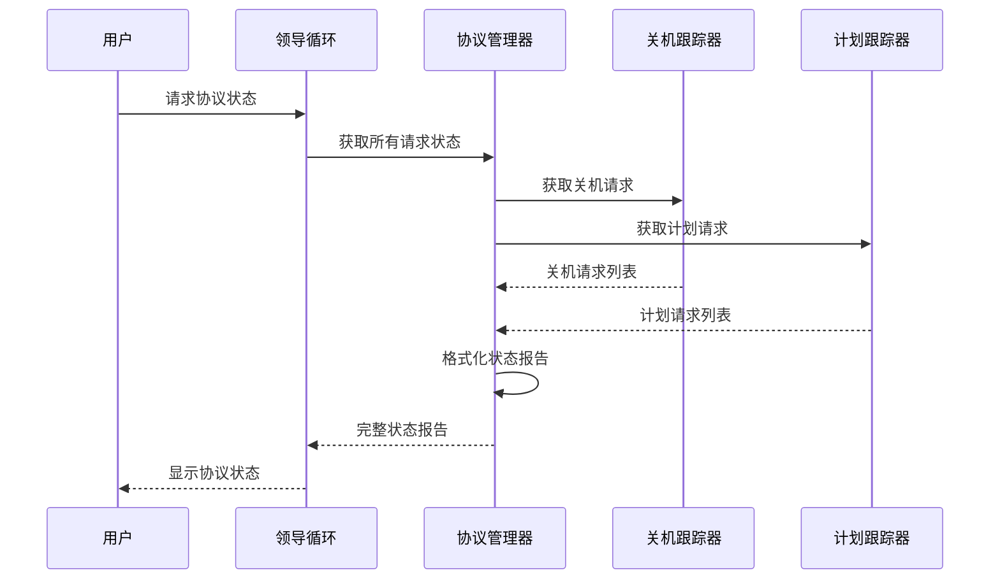
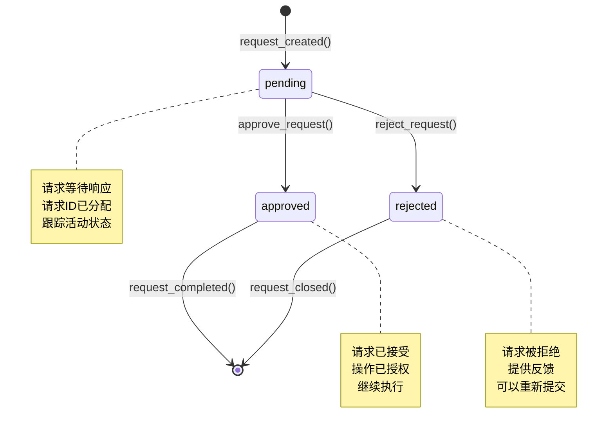
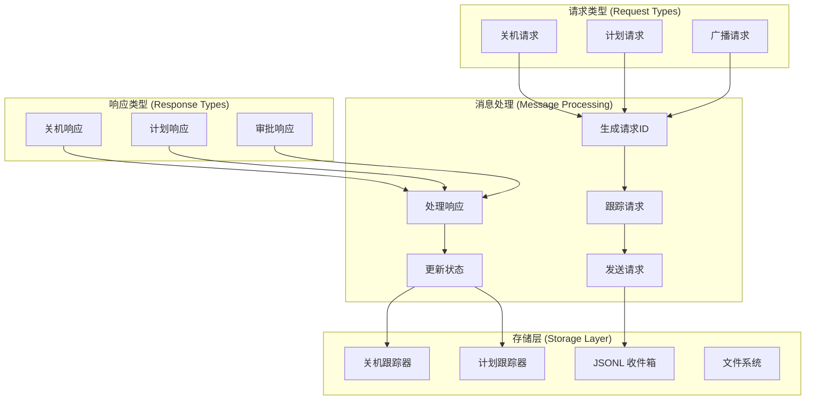
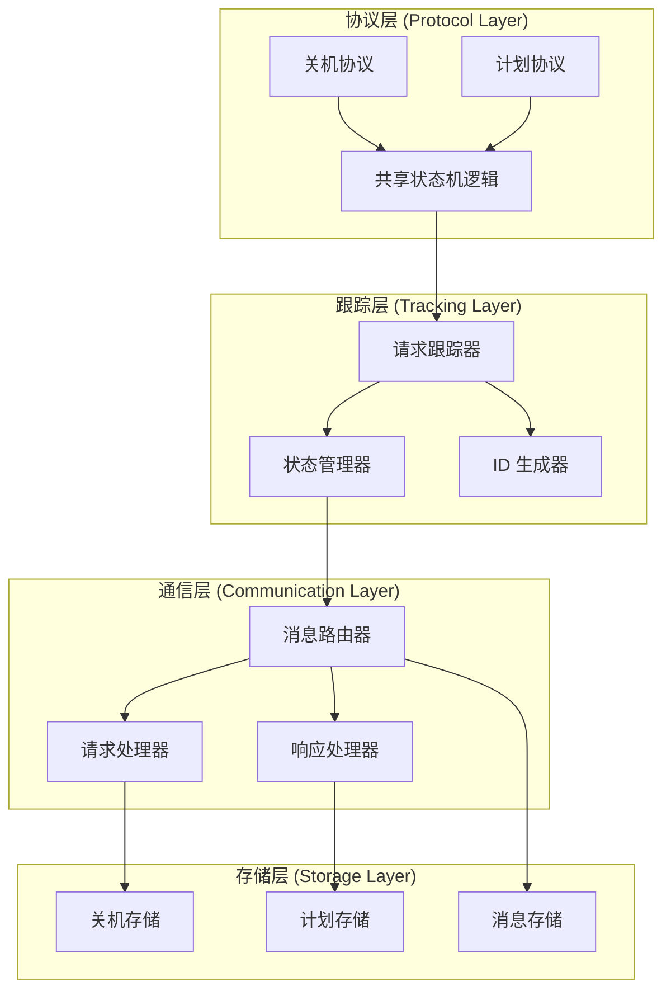
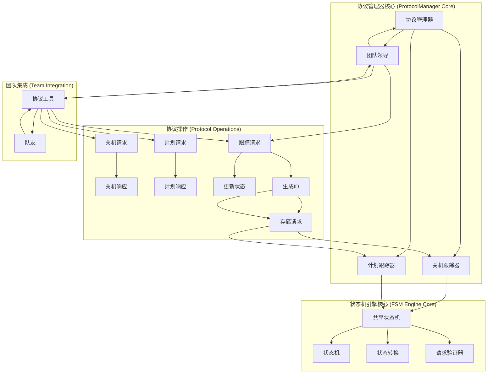

# s10: Team Protocols (团队协议)

`s01 > s02 > s03 > s04 > s05 > s06 | s07 > s08 > s09 > [ s10 ] s11 > s12`

> _"队友之间要有统一的沟通规矩"_ -- 一个 request-response 模式驱动所有协商。
>
> **Harness 层**: 协议 -- 模型之间的结构化握手。

## 问题

s09 中队友能干活能通信, 但缺少结构化协调:

**关机**: 直接杀线程会留下写了一半的文件和过期的 config.json。需要握手 -- 领导请求, 队友批准 (收尾退出) 或拒绝 (继续干)。

**计划审批**: 领导说 "重构认证模块", 队友立刻开干。高风险变更应该先过审。

两者结构一样: 一方发带唯一 ID 的请求, 另一方引用同一 ID 响应。

## 解决方案

```
Shutdown Protocol            Plan Approval Protocol
==================           ======================

Lead             Teammate    Teammate           Lead
  |                 |           |                 |
  |--shutdown_req-->|           |--plan_req------>|
  | {req_id:"abc"}  |           | {req_id:"xyz"}  |
  |                 |           |                 |
  |<--shutdown_resp-|           |<--plan_resp-----|
  | {req_id:"abc",  |           | {req_id:"xyz",  |
  |  approve:true}  |           |  approve:true}  |

Shared FSM:
  [pending] --approve--> [approved]
  [pending] --reject---> [rejected]

Trackers:
  shutdown_requests = {req_id: {target, status}}
  plan_requests     = {req_id: {from, plan, status}}
```

## 工作原理

### System Prompt

```
You are a team lead at %s. Manage teammates with shutdown and plan approval protocols.
```

1. 领导生成 request_id, 通过收件箱发起关机请求。

```go
// 请求跟踪器
// 用于跟踪关闭请求和计划审批请求的状态
var (
	shutdownRequests = make(map[string]map[string]string) // 关闭请求映射表
	planRequests     = make(map[string]map[string]string) // 计划请求映射表
	trackerLock      sync.Mutex                           // 互斥锁，确保并发安全
)

func handleShutdownRequest(teammate string) string {
	trackerLock.Lock()
	defer trackerLock.Unlock()

	// 生成8位请求ID
	reqID := fmt.Sprintf("%08d", time.Now().UnixNano()%100000000)
	shutdownRequests[reqID] = map[string]string{
		"target": teammate,
		"status": "pending",
	}

	bus.Send("lead", teammate, "Please shut down gracefully.",
		"shutdown_request", map[string]interface{}{"request_id": reqID})

	return fmt.Sprintf("Shutdown request %s sent (status: pending)", reqID)
}
```

2. 队友收到请求后, 用 approve/reject 响应。

```go
if toolName == "shutdown_response" {
	reqID := args["request_id"].(string)
	approve := args["approve"].(bool)

	trackerLock.Lock()
	if req, exists := shutdownRequests[reqID]; exists {
		if approve {
			req["status"] = "approved"
		} else {
			req["status"] = "rejected"
		}
		shutdownRequests[reqID] = req
	}
	trackerLock.Unlock()

	reason := ""
	if r, ok := args["reason"]; ok {
		reason = r.(string)
	}

	bus.Send(sender, "lead", reason,
		"shutdown_response",
		map[string]interface{}{"request_id": reqID, "approve": approve})
}
```

3. 计划审批遵循完全相同的模式。队友提交计划 (生成 request_id), 领导审查 (引用同一个 request_id)。

```go
func handlePlanReview(requestID string, approve bool, feedback string) {
	trackerLock.Lock()
	defer trackerLock.Unlock()

	if req, exists := planRequests[requestID]; exists {
		if approve {
			req["status"] = "approved"
		} else {
			req["status"] = "rejected"
		}
		planRequests[requestID] = req

		bus.Send("lead", req["from"], feedback,
			"plan_approval_response",
			map[string]interface{}{"request_id": requestID, "approve": approve})
	}
}
```

一个 FSM, 两种用途。同样的 `pending -> approved | rejected` 状态机可以套用到任何请求-响应协议上。

## 相对 s09 的变更

| 组件     | 之前 (s09) | 之后 (s10)                    |
| -------- | ---------- | ----------------------------- |
| Tools    | 9          | 12 (+shutdown_req/resp +plan) |
| 关机     | 仅自然退出 | 请求-响应握手                 |
| 计划门控 | 无         | 提交/审查与审批               |
| 关联     | 无         | 每个请求一个 request_id       |
| FSM      | 无         | pending -> approved/rejected  |

## 试一试

```sh
cd ai-agent-study/s10
go run main.go
```

试试这些 prompt (英文 prompt 对 LLM 效果更好, 也可以用中文):

1. `Spawn alice as a coder. Then request her shutdown.`
2. `List teammates to see alice's status after shutdown approval`
3. `Spawn bob with a risky refactoring task. Review and reject his plan.`
4. `Spawn charlie, have him submit a plan, then approve it.`
5. 输入 `/team` 监控状态

## 业务流程图

### 系统架构总览



### 详细流程序列

#### 1. 关机请求协议流程



#### 2. 计划审批协议流程



#### 3. 共享 FSM 状态管理流程



#### 4. 协议跟踪监控流程



### 关键状态转换



### 协议消息流架构



### 协议协调架构



### 核心组件交互


