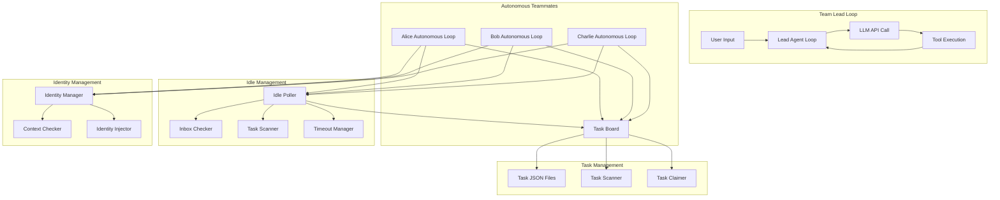
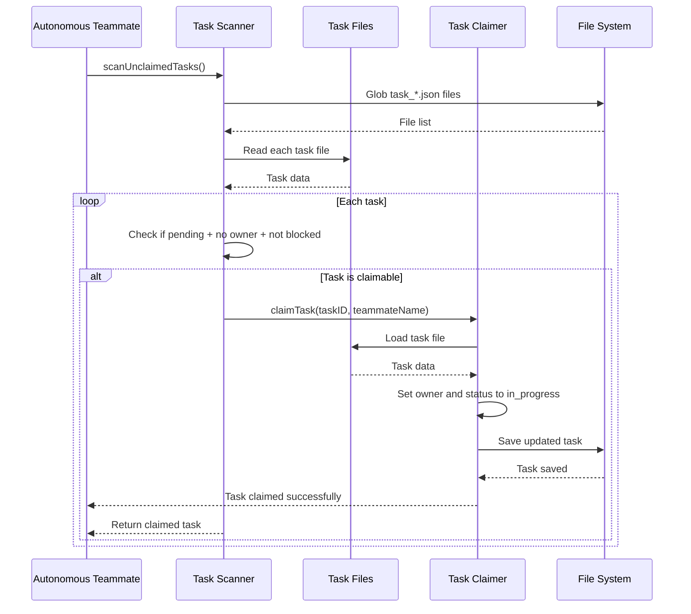
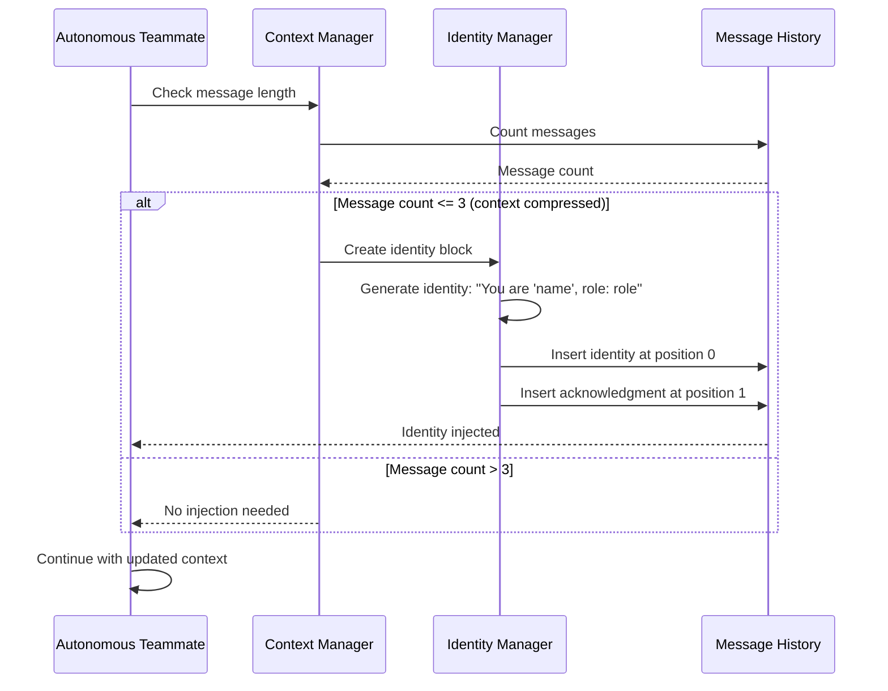
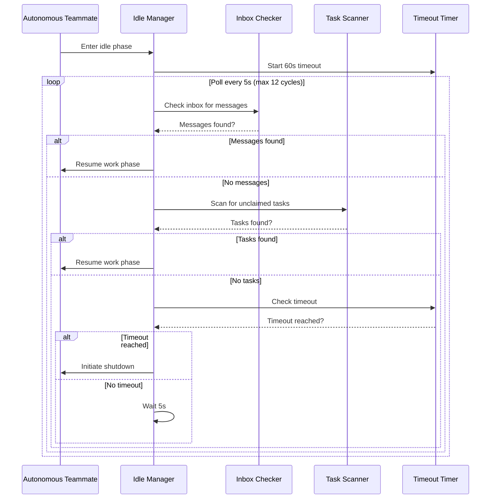
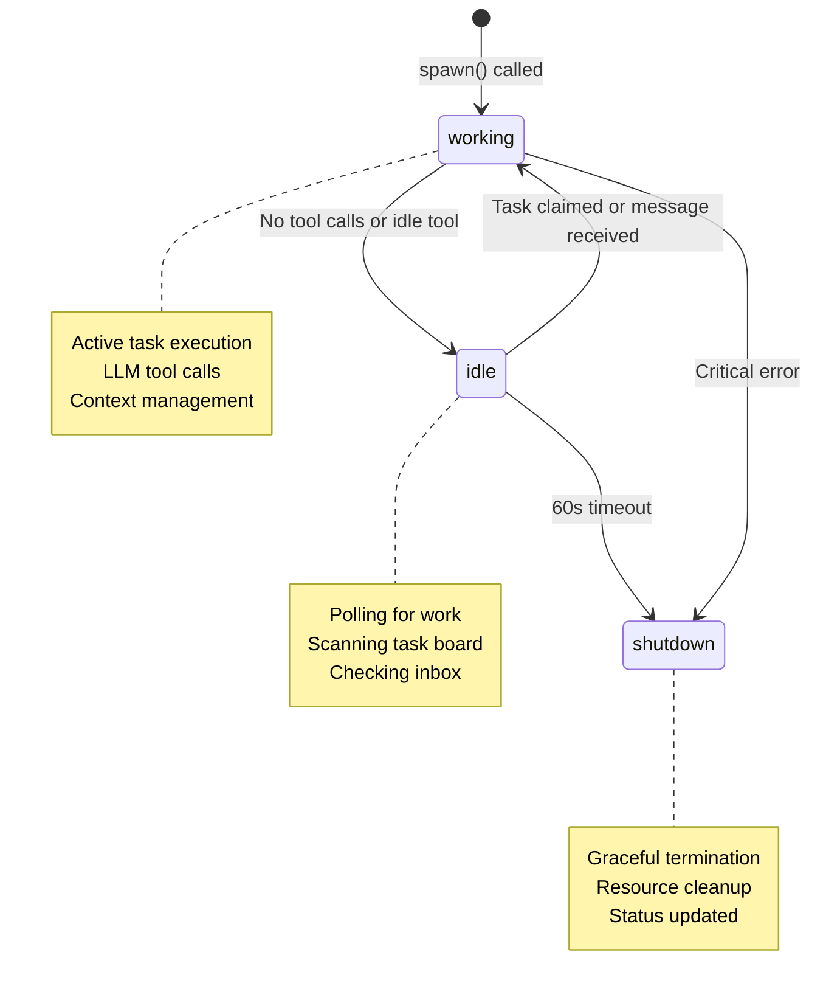
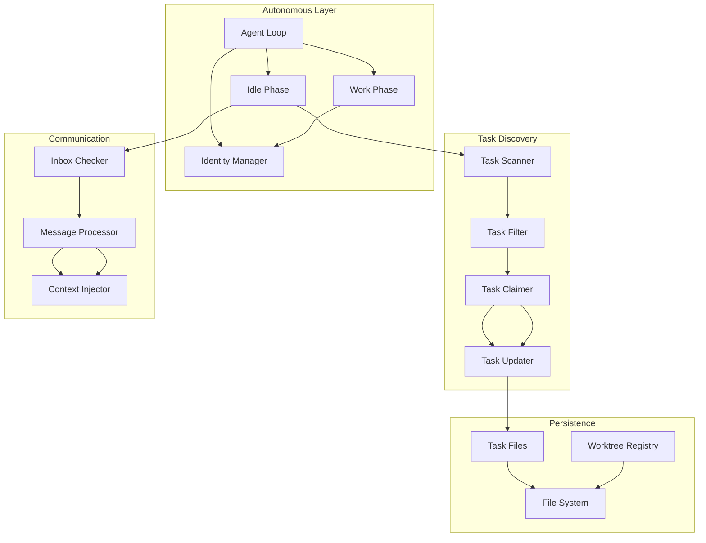
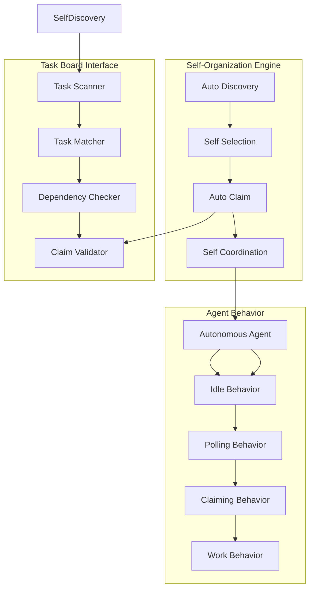
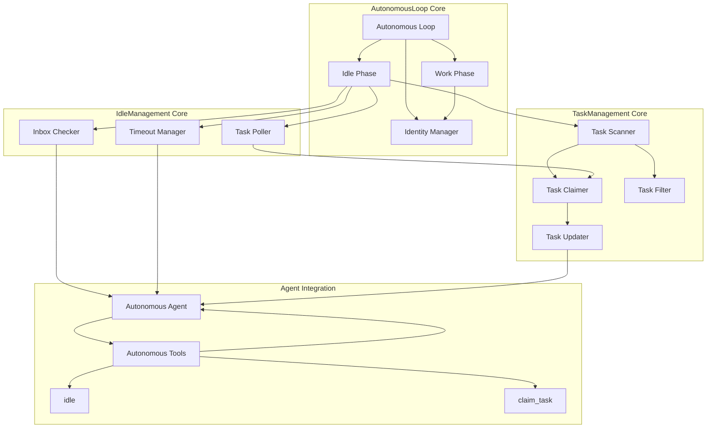

# s11: Autonomous Agents (自治智能体)

`s01 > s02 > s03 > s04 > s05 > s06 | s07 > s08 > s09 > s10 > [ s11 ] s12`

> _"队友自己看看板, 有活就认领"_ -- 不需要领导逐个分配, 自组织。
>
> **Harness 层**: 自治 -- 模型自己找活干, 无需指派。

## 问题

s09-s10 中, 队友只在被明确指派时才动。领导得给每个队友写 prompt, 任务看板上 10 个未认领的任务得手动分配。这扩展不了。

真正的自治: 队友自己扫描任务看板, 认领没人做的任务, 做完再找下一个。

一个细节: 上下文压缩 (s06) 后智能体可能忘了自己是谁。身份重注入解决这个问题。

## 解决方案

```
Teammate lifecycle with idle cycle:

+-------+
| spawn |
+---+---+
    |
    v
+-------+   tool_use     +-------+
| WORK  | <------------- |  LLM  |
+---+---+                +-------+
    |
    | stop_reason != tool_use (or idle tool called)
    v
+--------+
|  IDLE  |  poll every 5s for up to 60s
+---+----+
    |
    +---> check inbox --> message? ----------> WORK
    |
    +---> scan .tasks/ --> unclaimed? -------> claim -> WORK
    |
    +---> 60s timeout ----------------------> SHUTDOWN

Identity re-injection after compression:
  if len(messages) <= 3:
    messages.insert(0, identity_block)
```

## 工作原理

#### System Prompt

```
You are a team lead at %s. Teammates are autonomous.
```

1. 队友循环分两个阶段: WORK 和 IDLE。LLM 停止调用工具 (或调用了 `idle`) 时, 进入 IDLE。

```go
func (tm *TeammateManager) autonomousLoop(name, role, prompt string) {
	messages := []Message{{Role: "user", Content: prompt}}
	for {
		// -- WORK PHASE --
		for i := 0; i < 50; i++ {
			// 身份重注入检查
			if len(messages) <= 3 {
				identityBlock := fmt.Sprintf("<identity>You are '%s', role: %s, team: my-team. Continue your work.</identity>", name, role)
				messages = append([]Message{{Role: "user", Content: identityBlock}}, messages...)
				messages = append([]Message{{Role: "assistant", Content: fmt.Sprintf("I am %s. Continuing.", name)}}, messages[1:]...)
			}

			msg, err := chatCompletionsCreate(messages, openAITools())
			if err != nil {
				log.Printf("Error in autonomous loop: %v", err)
				break
			}

			messages = append(messages, msg)

			if len(msg.ToolCalls) == 0 {
				break
			}

			// 执行工具调用...
			for _, tc := range msg.ToolCalls {
				// 检查是否调用了 idle 工具
				if tc.Function.Name == "idle" {
					break // 退出工作阶段
				}
				// ... 其他工具执行逻辑 ...
			}
		}

		// -- IDLE PHASE --
		tm.setStatus(name, "idle")
		resume := tm.idlePoll(name, &messages)
		if !resume {
			tm.setStatus(name, "shutdown")
			return
		}
		tm.setStatus(name, "working")
	}
}
```

2. 空闲阶段循环轮询收件箱和任务看板。

```go
func (tm *TeammateManager) idlePoll(name string, messages *[]Message) bool {
	maxCycles := int(idleTimeout.Seconds() / pollInterval.Seconds()) // 60s / 5s = 12
	for i := 0; i < maxCycles; i++ {
		time.Sleep(pollInterval)

		// 检查收件箱
		inboxMsgs, err := bus.ReadInbox(name)
		if err == nil && len(inboxMsgs) > 0 {
			var inboxTexts []string
			for _, msg := range inboxMsgs {
				inboxTexts = append(inboxTexts, fmt.Sprintf("[%s] %s: %s", msg.Type, msg.From, msg.Content))
			}
			*messages = append(*messages, Message{Role: "user", Content: fmt.Sprintf("<inbox>\n%s\n</inbox>", strings.Join(inboxTexts, "\n"))})
			return true
		}

		// 扫描未认领的任务
		unclaimed := tm.scanUnclaimedTasks()
		if len(unclaimed) > 0 {
			taskID := unclaimed[0].ID
		tm.claimTask(taskID, name)
			*messages = append(*messages, Message{Role: "user", Content: fmt.Sprintf("<auto-claimed>Task #%d: %s</auto-claimed>", taskID, unclaimed[0].Subject)})
			return true
		}
	}
	return false // timeout -> shutdown
}
```

3. 任务看板扫描: 找 pending 状态、无 owner、未被阻塞的任务。

```go
func (tm *TeammateManager) scanUnclaimedTasks() []Task {
	files, _ := filepath.Glob(filepath.Join(tasksDir, "task_*.json"))
	var unclaimed []Task
	for _, file := range files {
		content, err := os.ReadFile(file)
		if err != nil {
			continue
		}
		var task Task
		if err := json.Unmarshal(content, &task); err != nil {
			continue
		}
		if task.Status == "pending" && task.Owner == "" && len(task.BlockedBy) == 0 {
			unclaimed = append(unclaimed, task)
		}
	}
	return unclaimed
}

func (tm *TeammateManager) claimTask(taskID int, owner string) error {
	// 更新任务的所有者
	taskPath := filepath.Join(tasksDir, fmt.Sprintf("task_%d.json", taskID))
	content, err := os.ReadFile(taskPath)
	if err != nil {
		return err
	}
	var task Task
	if err := json.Unmarshal(content, &task); err != nil {
		return err
	}
	task.Owner = owner
	task.Status = "in_progress"
	updatedContent, _ := json.MarshalIndent(task, "", "  ")
	return os.WriteFile(taskPath, updatedContent, 0644)
}
```

4. 身份重注入: 上下文过短 (说明发生了压缩) 时, 在开头插入身份块。

```go
// 身份重注入逻辑已集成在 autonomousLoop 中
if len(messages) <= 3 {
    identityBlock := fmt.Sprintf("<identity>You are '%s', role: %s, team: my-team. Continue your work.</identity>", name, role)
    messages = append([]Message{{Role: "user", Content: identityBlock}}, messages...)
    messages = append([]Message{{Role: "assistant", Content: fmt.Sprintf("I am %s. Continuing.", name)}}, messages[1:]...)
}
```

## 相对 s10 的变更

| 组件     | 之前 (s10) | 之后 (s11)              |
| -------- | ---------- | ----------------------- |
| Tools    | 12         | 14 (+idle, +claim_task) |
| 自治性   | 领导指派   | 自组织                  |
| 空闲阶段 | 无         | 轮询收件箱 + 任务看板   |
| 任务认领 | 仅手动     | 自动认领未分配任务      |
| 身份     | 系统提示   | + 压缩后重注入          |
| 超时     | 无         | 60 秒空闲 -> 自动关机   |

## 试一试

```sh
cd ai-agent-study/s11
go run main.go
```

试试这些 prompt (英文 prompt 对 LLM 效果更好, 也可以用中文):

1. `Create 3 tasks on the board, then spawn alice and bob. Watch them auto-claim.`
2. `Spawn a coder teammate and let it find work from the task board itself`
3. `Create tasks with dependencies. Watch teammates respect the blocked order.`
4. 输入 `/tasks` 查看带 owner 的任务看板
5. 输入 `/team` 监控谁在工作、谁在空闲

## Business Flow Diagram

### Overall System Architecture



### Detailed Flow Sequences

#### 1. Autonomous Agent Lifecycle Flow

```mermaid
sequenceDiagram
    participant Lead as Lead Loop
    participant Teammate as Autonomous Teammate
    participant WorkPhase as Work Phase
    participant IdlePhase as Idle Phase
    participant TaskBoard as Task Board

    Lead->>Teammate: spawn autonomous teammate
    Teammate->>WorkPhase: Enter work phase

    loop Work Phase (max 50 iterations)
        WorkPhase->>WorkPhase: Check identity context
        WorkPhase->>WorkPhase: LLM chat completion
        WorkPhase->>WorkPhase: Execute tool calls
        alt No more tool calls or idle tool called
            WorkPhase->>IdlePhase: Enter idle phase
            break
        end
    end

    IdlePhase->>IdlePhase: Set status to idle
    IdlePhase->>TaskBoard: Scan for unclaimed tasks
    alt Task found
        IdlePhase->>TaskBoard: Claim task
        TaskBoard-->>IdlePhase: Task claimed
        IdlePhase->>WorkPhase: Resume work phase
    else No task found
        IdlePhase->>IdlePhase: Check inbox
        alt Message found
            IdlePhase->>WorkPhase: Resume work phase
        else Timeout reached
            IdlePhase->>Teammate: Shutdown
        end
    end
```

#### 2. Task Auto-Claim Flow



#### 3. Identity Re-injection Flow



#### 4. Idle Polling Management Flow



### Key State Transitions



### Autonomous Task Management Architecture



### Self-Organization Architecture



### Core Components Interaction


